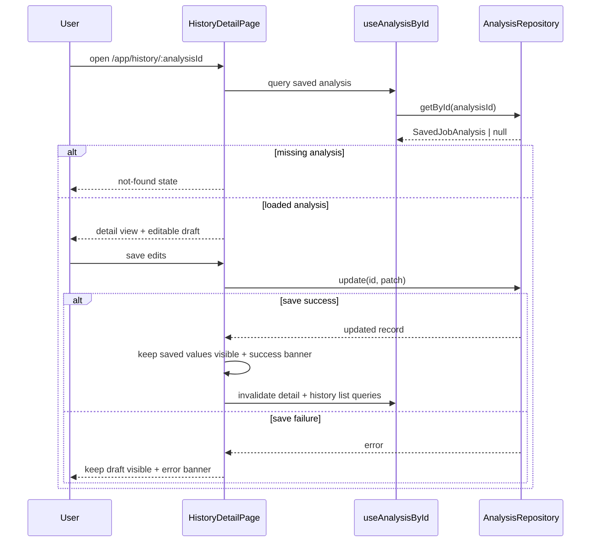

# Design: Module 15 - History Interactions

## Technical Approach

Persist detail edits through the existing analysis repository instead of introducing a separate notes store. `HistoryDetailPage` remains the route-level orchestrator: it loads the saved analysis, handles loading/not-found states, owns the save mutation, and passes a controlled draft form to a history-specific editor component. The list/export flow stays untouched, and the match score chip remains derived from current UI data only.

## Architecture Decisions

### Decision: Extend the current repository with an update contract

**Choice**: Add a partial `update(id, patch)` method to `AnalysisRepository` and implement it in `local-analysis-repository`.
**Alternatives considered**: A separate history-notes store; mutating `jobDescription` to simulate rename.
**Rationale**: One persistence path is simpler, keeps React Query invalidation consistent, and remains a drop-in shape for a future Supabase-backed repository. Mutating the original job description would destroy the source text and blur analysis vs. metadata.

### Decision: Keep the page as the state boundary

**Choice**: `src/pages/HistoryDetailPage.tsx` owns route params, detail query, mutation orchestration, and not-found/loading routing. A new feature component renders the editable form and inline banners.
**Alternatives considered**: Putting fetch/mutation logic inside the component; lifting everything into a global store.
**Rationale**: The route is already the natural boundary for missing-id and not-found handling. Local component state is enough for drafts, and avoiding a store prevents sync drift between loaded data, saved data, and retry edits.

### Decision: Persist rename as metadata, not score or computed fields

**Choice**: Store editable metadata such as `displayName` and `notes` on the saved record, while keeping `matchIndex` absent and the score chip computed from current analysis data.
**Alternatives considered**: Persisting the score; encoding rename in the rendered title formatter.
**Rationale**: The analysis result must remain the source of truth for the score and technical content. Derived score persistence would create a stale contract, and rename metadata is a cleaner fit for record-level editing.

## Data Flow



## File Changes

| File | Action | Description |
|------|--------|-------------|
| `src/lib/repositories/analysis-repository.ts` | Modify | Add the update contract and patch type for persisted detail edits. |
| `src/lib/repositories/local-analysis-repository.ts` | Modify | Merge editable metadata into the stored record and preserve existing entries. |
| `src/schemas/job-analysis.ts` | Modify | Allow optional persisted detail metadata on `SavedJobAnalysis`. |
| `src/features/history/hooks/useUpdateAnalysis.ts` | Create | Wrap the update mutation and invalidate history/detail queries. |
| `src/features/history/components/HistoryDetailEditor.tsx` | Create | Render the editable form, save/cancel actions, and inline success/error states. |
| `src/pages/HistoryDetailPage.tsx` | Modify | Orchestrate loading, not-found, and save states; wire the editor component. |

## Interfaces / Contracts

```ts
export interface AnalysisUpdatePatch {
  displayName?: string;
  notes?: string;
}

export interface AnalysisRepository {
  save(jobDescription: string, result: JobAnalysisResult): Promise<SavedJobAnalysis>;
  getAll(): Promise<SavedJobAnalysis[]>;
  getById(id: string): Promise<SavedJobAnalysis | null>;
  update(id: string, patch: AnalysisUpdatePatch): Promise<SavedJobAnalysis | null>;
  delete(id: string): Promise<void>;
}
```

`update` returns `null` when the record no longer exists, which lets the detail page surface a not-found state if the record disappears between load and save.

## Testing Strategy

| Layer | What to Test | Approach |
|-------|-------------|----------|
| Unit | Repository update merge, schema validation, derived score behavior | Test the local repository and the saved-analysis schema directly. |
| Integration | Detail save flow, success/error banners, not-found state | Exercise the detail page with a mock repository and React Query cache. |
| E2E | Load detail, edit metadata, reload, retry after failure | Verify the persisted values survive navigation and that failures keep the draft visible. |

## Migration / Rollout

No migration required. The new persisted metadata is additive, old records remain valid, and the score chip continues to be computed from existing analysis data.

## Open Questions

- None.